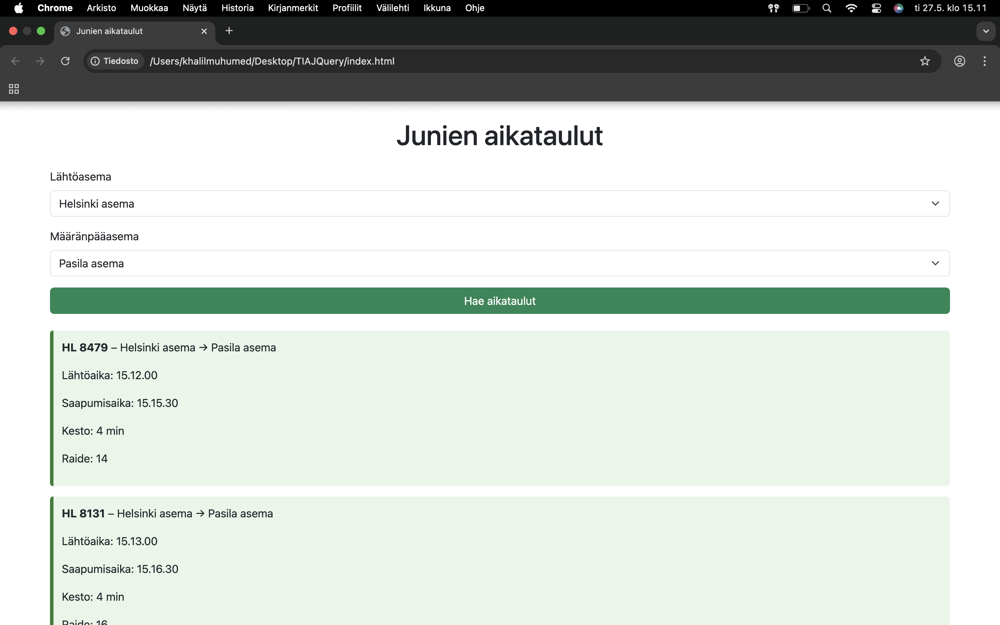

# Junien Aikatauluhaku 2.0  
A simple jQuery-based application to search train schedules between stations in Finland.  
**Author:** Khalil Muhumed

## Demo link:
Access my site at [Netlify Deployment Link](https://tiajquery.netlify.app/) 

## How was the workload divided
This was an individual project. All planning, development, design, testing, and documentation were done by me, Khalil Muhumed.

## Table of Content:

- [About The App](#about-the-app)
- [Screenshots](#screenshots)
- [Technologies](#technologies)
- [Setup](#setup)
- [Approach](#approach)
- [Status](#status)
- [Credits](#credits)
- [License](#license)

## About The App
**Junien Aikatauluhaku 2.0** is a lightweight web application that fetches live train schedules between selected stations using the Digitraffic API. The user selects a departure and destination station from dropdowns, clicks "Hae aikataulut", and gets real-time information including delay, platform, travel duration, and more.

The app uses:
- jQuery for DOM manipulation and AJAX
- localStorage for saving the user's last selected route
- fadeIn effects for better user experience

## Screenshots

*Picture by [Khalil Muhumed]*

## Technologies
- `HTML`
- `CSS`
- `Bootstrap`
- `JavaScript`
- `jQuery`
- `Digitraffic API`
- `localStorage`

## Setup
To run this app locally:

- Download or clone the repository
- Place `index.html`, `style.css`, and `script.js` in the same folder
- Open `index.html` in your browser

## Approach
I used jQuery’s $.getJSON() function to call the Digitraffic API at https://rata.digitraffic.fi.
All stations with passenger traffic are added to two dropdowns.
Train data is filtered to include only future departures that also arrive at the selected destination.
Results are sorted by departure time.
DOM updates and event handling are done with jQuery.
The user’s last selected route is saved and loaded using localStorage.

## Status
Train Schedule App is complete and functional. Future improvements may include:
- Filtering by train type or departure time
- Better accessibility and mobile layout

## Credits
- [Digitraffic API](https://www.digitraffic.fi)
- [w3schools](https://www.w3schools.com/jquery/default.asp)
- [Public APIs GitHub](https://www.digitraffic.fi)
- ChatGPT was used for assist

## License
This project is licensed under the MIT License.  
More info: [MIT License](https://opensource.org/licenses/MIT)
